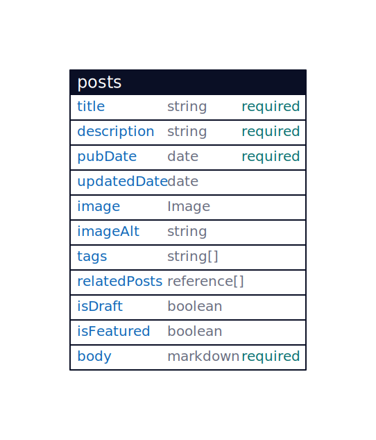

# crossinguard.dev

Personal website built with Astro 5, featuring blog posts and project showcases.

## Commands

All commands are run from the root of the project, from a terminal:

| Command | Action |
| :--- | :--- |
| `bun run dev` | Start development server at `localhost:4321` |
| `bun run build` | Build production site to `./dist/` |
| `bun run preview` | Preview build locally |

## Tools & Resources

- web framework: [Astro](https://astro.build/)
  - [astro icons](https://www.astroicon.dev/)
- online repository: [Codeberg](https://codeberg.org/)
- web hosting platform: [Netlify](https://www.netlify.com/)
- fluid design: [Utopia](https://utopia.fyi/)

## Content Collections

### Posts

### Posts

| Field | Type | Constraint |
| :--- | :--- | :--- |
| title | string | required |
| description | string | required |
| pubDate | date | required |
| updatedDate | date | |
| image | Image | |
| imageAlt | string | |
| tags | string[] | |
| relatedPosts | reference[] | |
| isDraft | boolean | |
| isFeatured | boolean | |
| body | markdown | required |
